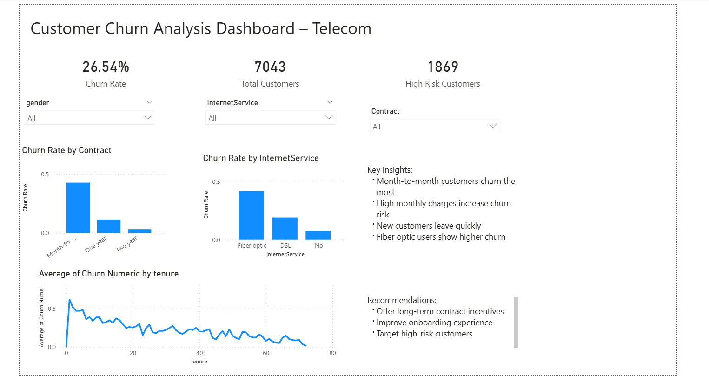

# customer-churn-analysis
Customer Churn Analysis using Python and Power BI to identify customer retention strategies
# 📊 Customer Churn Analysis – Telecom

## 🔗 Project Link

https://github.com/narmadhadevipalaniappan/customer-churn-analysis 

---

## 🔍 Project Overview

This project analyses customer churn behaviour in a telecom company to identify the key factors driving customer attrition. Using Python for data analysis and Power BI for visualisation, the project transforms raw data into actionable business insights to improve customer retention.

---

## 🎯 Business Problem

Customer churn is a major challenge for telecom companies, leading to revenue loss and increased customer acquisition costs. The objective of this project is to understand why customers leave and recommend strategies to reduce churn.

---

## 🛠 Tools & Technologies

* Python (Google Colab)
* Pandas (Data Analysis)
* Power BI (Dashboard & Visualisation)
* DAX (Measures & KPIs)

---

## 🔄 Data Pipeline

1. Data loaded into Python (Google Colab)
2. Data cleaned and transformed
3. Exploratory data analysis performed using Pandas
4. Insights visualised through Power BI dashboard

---

## 📊 Dashboard Features

* KPI Metrics:

  * Churn Rate
  * Total Customers
  * High-Risk Customers
* Churn Rate by Contract Type
* Churn Rate by Internet Service
* Churn Rate by Customer Tenure
* Interactive filters (Gender, Contract, Internet Service)

---

## 📈 Key Insights

* Month-to-month contract customers show the highest churn rate
* Customers with higher monthly charges are more likely to leave
* New customers (low tenure) are at greater risk of churn
* Fiber optic users exhibit higher churn compared to other services

---

## 💡 Business Recommendations

* Encourage long-term contracts through discounts and incentives
* Improve onboarding experience for new customers
* Implement targeted retention strategies for high-risk customers

---

## 📸 Dashboard Preview

---

## 📁 Project Structure

* data/ → Dataset
* notebooks/ → Python analysis (Colab)
* dashboard/ → Power BI dashboard (.pbix + screenshot)

---

## 🧠 Skills Demonstrated

* Data Cleaning & Transformation
* Exploratory Data Analysis (EDA)
* KPI Development using DAX
* Data Visualisation (Power BI)
* Business Insight Generation
* Data Storytelling

---

## ▶️ How to Use

1. Download dataset from the `data/` folder
2. Open the notebook in Google Colab
3. Run the analysis
4. Open the Power BI file to explore the dashboard

---

## 🚀 Author
Narmadhadevi Palaniappan
